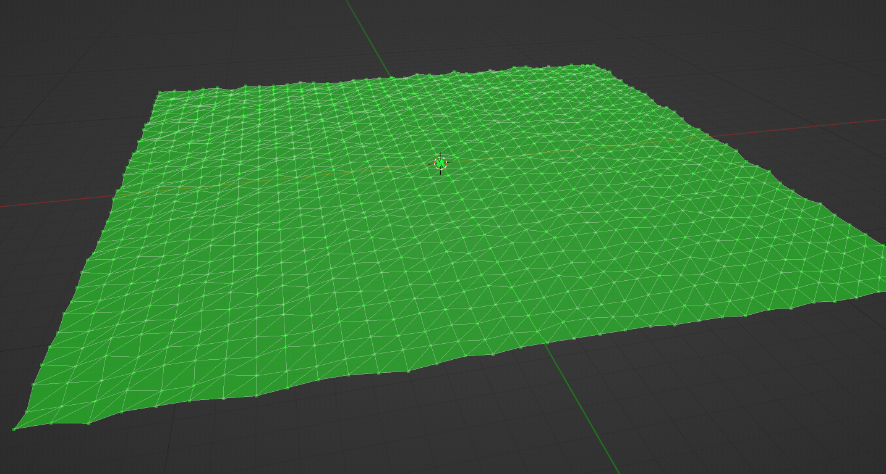

# Vlander addon for Blender 3D
### Awesome addon for ...

## Links

- [Repo](https://github.com/notwarp/vlander "<vlander> Repo")

- [Bugs](https://github.com/notwarp/vlander/issues "Issues Page")

## Screenshots

## Built With

- Python 3.9.2
- Blender 3D 2.93.5

## Future Updates

- [ ] First Release
- [ ] Bug Free
- [ ] Write Documentation

## Author

**Daniele Giuliani**

- [Profile](https://github.com/notwarp "Daniele Giuliani")
- [Email](mailto:d.giuliani304@gmail.com?subject=Hi "Hi!")
- [Website](https://notwarp.it "Welcome")

## 🤝 Support

Contributions, issues, and feature requests are welcome!

Give a ⭐️ if you like this project!